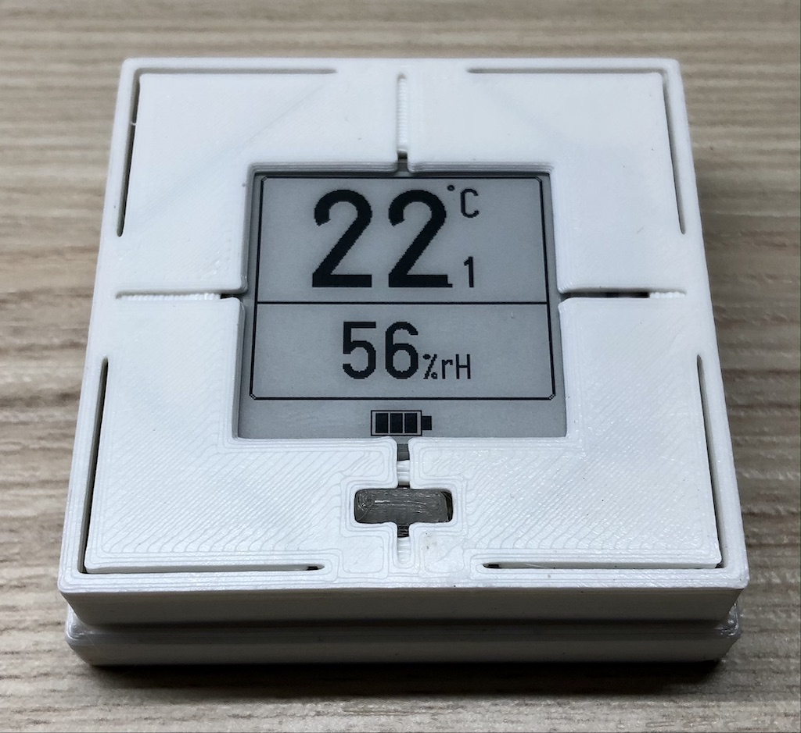
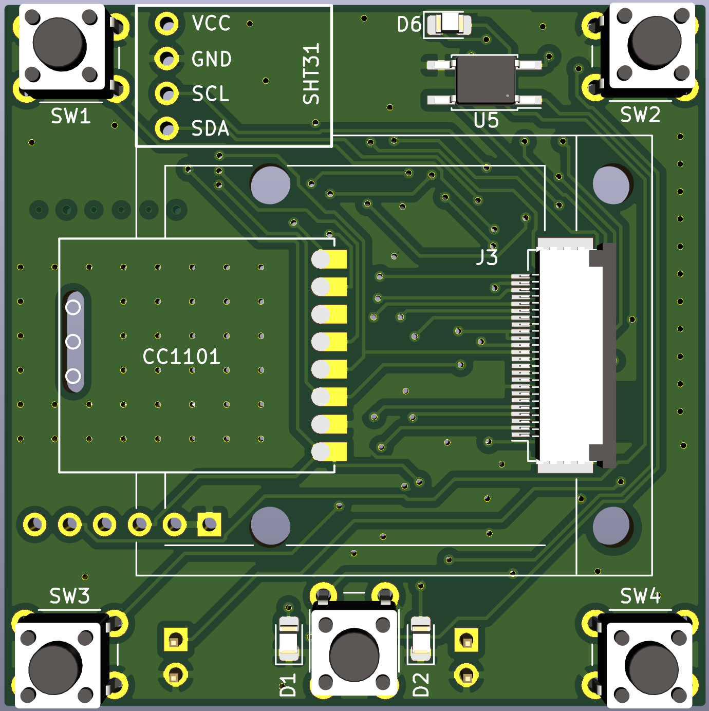
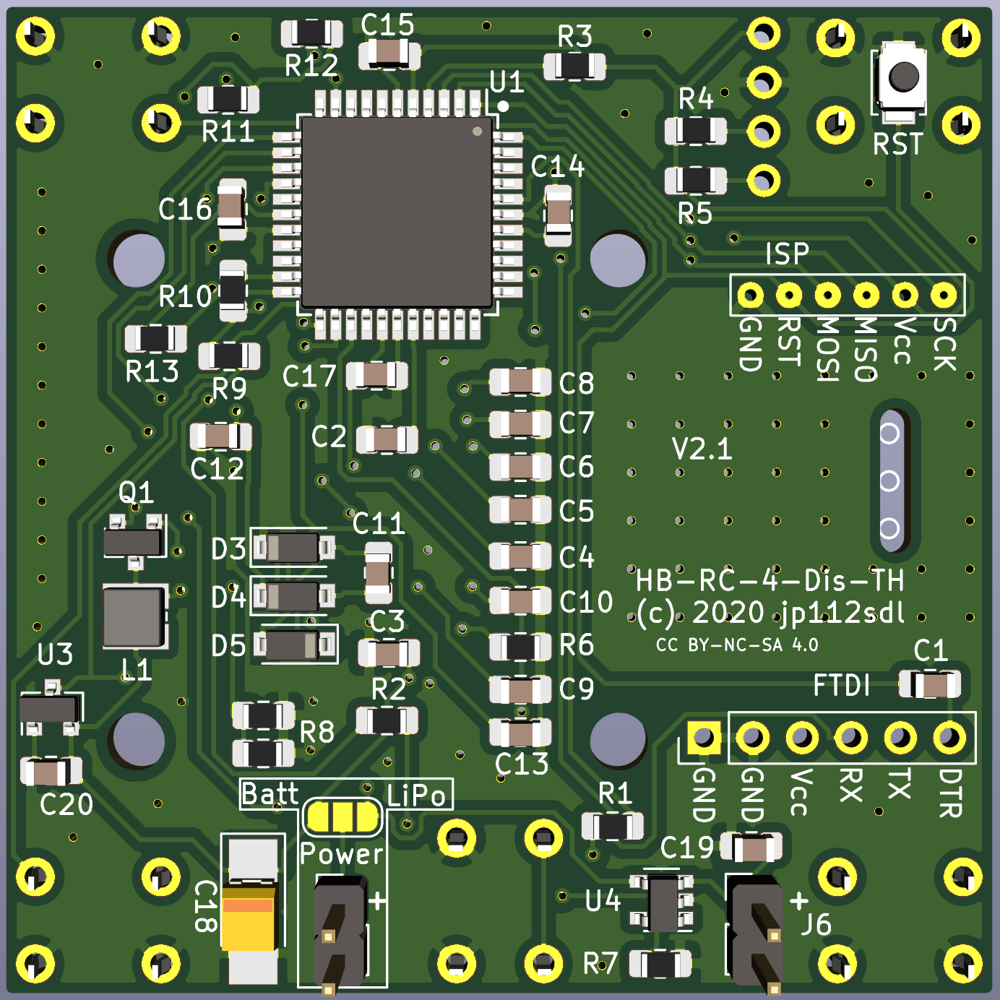

# HB-RC-4-Dis-TH
## 4fach Wandtaster mit Display und Temperatursensor

Als Vorlage/Idee diente das [AVM FRITZ!DECT 440](https://avm.de/produkte/fritzdect/fritzdect-440/).

### Aufbau:

An den 4 Ecken befinden sich Taster, um über 4 verschiedenen Tasterkanäle Geräte zu steuern. 
Unten mittig ist der Mode-Taster:
- langes Drücken = Anlernen oder (ganz lange) RESET
- kurzes Drücken = Anzeige der Tasterbeschriftung

In Ruhe werden auf dem Display die Temperatur (und wahlweise Luftfeuchtigkeit) sowie der Batteriezustand angezeigt.
Wird der Mode-Taster kurz gedrückt, erscheint für die in den Geräteeinstellungen festgelegte "Display Timeout" Zeit die Taster-Beschriftung.

Als Beschriftung lassen sich
- eine Überschrift (optional)
- 1 bis 2 Zeilen Beschriftungstext

hinterlegen

  

### Prototyp

Nur Temperaturanzeige: 
  
Temperatur- und Luftfeuchtigkeit: 
  
Tasterbeschriftungen: 

### PCB Version 2.1

 
**[Abstandhalter](https://github.com/jp112sdl/HB-RC-4-Dis-TH/blob/master/PCB/HB-RC-4-Dis-TH%20ePaper%20Spacer.stl) zwischen Platine und ePaper:** 
 

**erste Version von JLCPCB**

 
 

### CCU:

**Status und Bedienung -> Geräte** 

 
**Einstellungen -> Geräte** 

### Zutaten
| Anzahl LiPo | Anzahl Batt | Bezeichnung | Bauform | Artikelnummer (Reichelt)|
|--------|--------|-------------|----------|---------------|
|6  |6  | 100nF	| 0805	| X7R-G0805 100N
|11	|11	| 1µF/25V	| 0805	| KEM X5R0805 1,0U
|1	|1	| 100µ/10V	| 3528	| TAJ 3528 100/10
|2	|0	| 10µ/10V	| 0805	|KEM X5R0805 10U
|1	|1 | LED rot	| 0805	| OSO LHR974
|1	|1	| LED grün	| 0805	| OSO LGR971
|1	|0	| LED weiß	| 0805	| SLO SMD-W0805-0
|3	|3	| MBR0530	| SOD-123	| MBR0530T1G ONS 
|1	|1	| 68µH	| 3012	| L-1616FPS 68µ
|1	|1	| IRLML 6346 | SOT-23	| IRLML 6346
|1	|1	| ATMEGA 1284P-AU	| TQFP-44	| ATMEGA 1284P-AU
|1  |0  | MCP 1700T-3002E | SOT-23 | MCP 1700T-3002E
|1  |0  | MCP 73831T-2ACI | SOT-23-5 | MCP 73831T-2ACI
|1  |0	| PC357 | SO-4 | PC 357NJ0000F |
|2	|2	| 240	| 0805	| RND 0805 1 240
|1	|0	| 680	| 0805	| RND 0805 1 680
|1	|0	| 1k 	| 0805	| RND 0805 1 1,0K
|1	|0	| 2k2	| 0805	| RND 0805 1 2,2K
|1	|0	| 4k7	| 0805	| RND 0805 1 4,7k
|3	|3	| 10k	| 0805	| RND 0805 1 10K
|3	|1	| 100k	| 0805	| RND 0805 1 100K
|1	|0	| 470k	| 0805	| RND 0805 1 470K
|2	|2	| 1,0	| 0805	| SMD-0805 1,00
|5	|5	| Taster	| THT	| RND 210-00193
|1	|1	| Taster	| SMD	| https://de.aliexpress.com/item/1005001298009129.html
|1	|1	| ZIF-Sockel 24pol.	| ZIF SMD	| EA WF050-24S
|1 |1	| GoodDisplay ePaper 1,54" GDEW0154M09 ||https://de.aliexpress.com/item/4000993819257.html|
|1 |1 | SHT31 Sensor ||https://de.aliexpress.com/item/32850554676.html|
|1	|0	| 600mAh LiPo	| 	| https://www.ebay.de/itm/LiPo-Lithium-Polymer-3-7V-Akku-mit-BMS-PCB-Batterie-Handy-MP3-Tablet-Navi-LiIon/372814314688?ssPageName=STRK%3AMEBIDX%3AIT&var=641708800610 
|1	|0	| Induktionsladeempfänger	1x1,5cm | 	| https://de.aliexpress.com/item/4000086798457.html
|1	|0	| Induktionsladegerät	| 	| https://de.aliexpress.com/item/4000969719130.html
